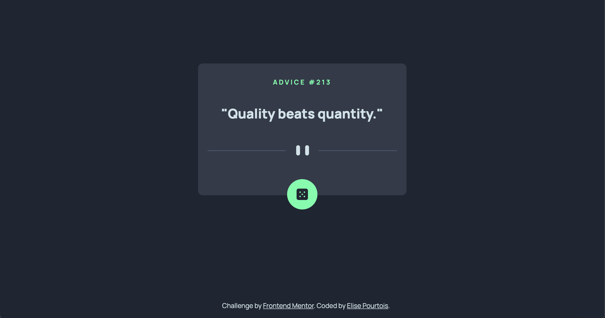
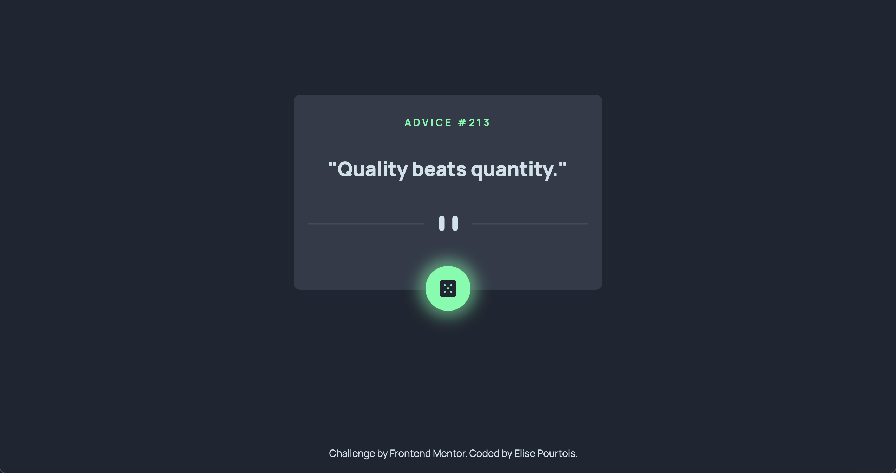

# ADVICE GENERATOR APP

This is a solution to the [Advice generator app challeng on Frontend Mentor](https://www.frontendmentor.io/challenges/advice-generator-app-QdUG-13db)

## Technologies used

## Challenge

Build out an advice generator app using the [Advice Slip API](https://api.adviceslip.com) and get it looking as close to the design as possible.

Users should be able to :

- [x] View the optimal layout for the app depending on their device's screen size
- [x] See hover states for all interactives elements on the page
- [x] Generate a new piece of advice by clicking the dice icon

## Result

    

 

    

