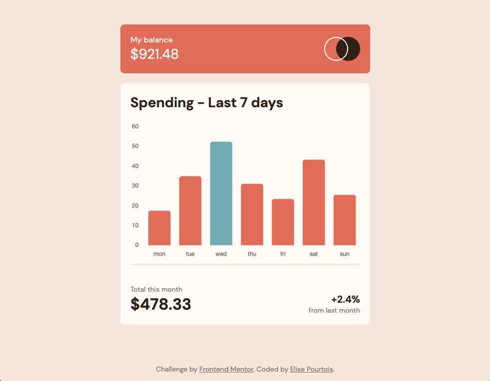

# EXPENSES CHART COMPONENT

This is a solution to the [Expenses chart component challenge on Frontend Mentor](https://www.frontendmentor.io/challenges/expenses-chart-component-e7yJBUdjwt).

## Technologies used

## Challenge

Create a bar chart component from scratch with the provided local JSON file and by using any tools to complete the challenge.

Users should be able to :

- [x] View the bar chart and hover over the individual bars to see the correct amounts for each day
- [x] See the highest bar highlighted in a different colour to the other bars
- [x] View the optimal layout for the content depending on their device's screen size
- [x] See hover states for all interactive elements on the page
- [x] **Bonus**: See dynamically generated bars based on the data provided in the local JSON file

## Result

    

