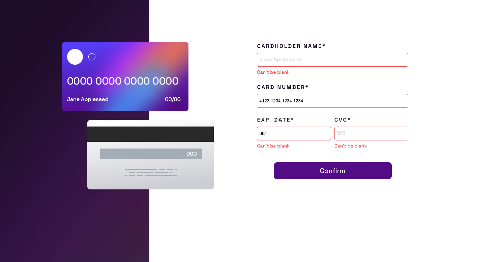

# INTERACTIVE CARD DETAILS FORM

This is a solution to the [Interactive card details form challenge on Frontend Mentor](https://www.frontendmentor.io/challenges/interactive-card-details-form-XpS8cKZDWw).

## Technologies used

## Challenge

Build out an interactiv card details form get it looking as close to the [design](/design/) as possible and by using any tools to complete the challenge.

Users should be able to :

- [x] Fill in the form and see card details update in real-time
- [x] Receive error message when the form is submitted if : 
    - Any input field is empty
    - The card number, expiry date, or CVC fields are in the wrong format
- [x] View the optimal layout depending on their device's screen size
- [x] See hover, active, and focus states for interactive elements on the page

## Result

    

    

    

    

