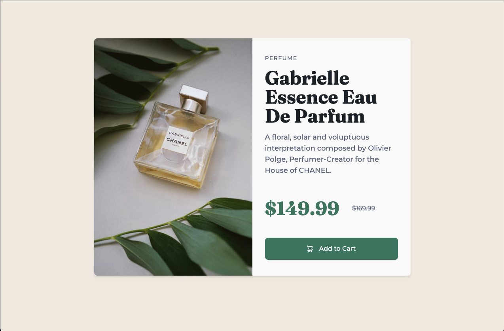

# PRODUCT PREVIEW CARD COMPONENT

This is a solution to the [Product preview card component challenge on Frontend Mentor](https://www.frontendmentor.io/challenges/product-preview-card-component-GO7UmttRfa).

## Technologies used

## Challenge

Build out a product preview card component and get it looking as close to the [design](/assets/design/) as possible.

Users should be able to :

- [x] View the optimal layout depending on their device's screen size
- [x] See hover and focus states for interactive elements

## Result

    

    

